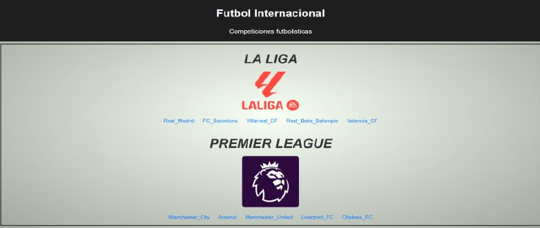
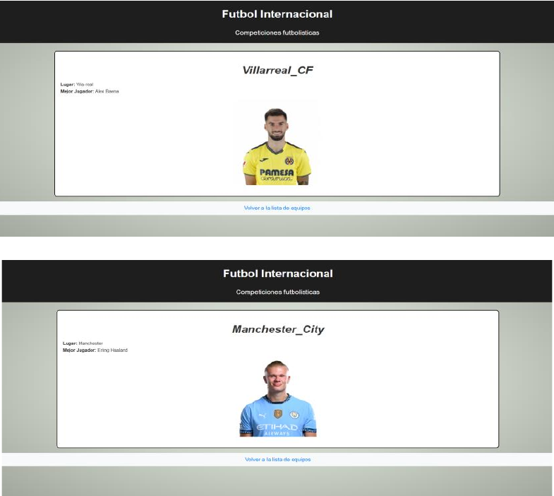

# EQUIPOS DE FÚTBOL

**Autor:** Iker Fernández  
**Fecha:** 18/11/2024  
**Asignatura:** Acceso a Datos

---

## ÍNDICE

1. [DESCRIPCIÓN](#1-descripción)
2. [FICHEROS DE ENTRADA](#2-ficheros-de-entrada)  
   2.1 [CONFIG.INI](#21-configini)  
   2.2 [JSON](#22-json)  
   2.3 [SCHEMA](#23-schema)
3. [CLASES](#3-clases)
4. [FICHEROS DE SALIDA](#4-ficheros-de-salida)  
   4.1 [XML RSS](#41-xml-rss)  
   4.2 [CAPTURAS DE LAS PÁGINAS](#42-capturas-de-las-páginas)

---

## 1. DESCRIPCIÓN

Este proyecto consiste en un generador de páginas web con la temática de los mejores equipos de Laliga y Premier League de fútbol, utilizando las plantillas Thymeleaf, archivos JSON con SCHEMA, un CONFIG.INI para definir el nombre, un XML RSS validado, y un ObjectMapper para parsear el JSON.

---

## 2. FICHEROS DE ENTRADA

### 2.1 CONFIG.INI
Es un archivo de configuración usado para almacenar parámetros de configuración de una aplicación estructurada y fácil de leer. Este es mi CONFIG.INI del proyecto:

```ini
[seccion]
nombre = Futbol Internacional
tema = Competiciones futbolisticas
```

---

### 2.2 JSON

El archivo JSON contiene los datos que tienen las ligas con sus equipos y sus mejores jugadores. Si añades un equipo, también se generará un archivo HTML del mismo. Este es mi JSON:
```json
{
  "laliga": [
    {
      "equipo": "Real_Madrid",
      "lugar": "Madrid",
      "mejor_jugador": "Vinícius Júnior",
      "imagen": "https://assets.laliga.com/squad/2024/t186/p246333/256x278/p246333_t186_2024_1_001_000.png"
    },
    {
      "equipo": "FC_Barcelona",
      "lugar": "Barcelona",
      "mejor_jugador": "Robert Lewandowski",
      "imagen": "https://assets.laliga.com/squad/2024/t178/p56764/256x278/p56764_t178_2024_1_001_000.png"
    },
    {
      "equipo": "Villarreal_CF",
      "lugar": "Vila-real",
      "mejor_jugador": "Alex Baena",
      "imagen": "https://assets.laliga.com/squad/2024/t449/p248501/256x278/p248501_t449_2024_1_001_000.png"
    },
    {
      "equipo": "Real_Betis_Balompie",
      "lugar": "Sevilla",
      "mejor_jugador": "Giovani Lo Celso",
      "imagen": "https://assets.laliga.com/squad/2024/t185/p200826/2048x2048/p200826_t185_2024_1_002_000.jpg"
    },
    {
      "equipo": "Valencia_CF",
      "lugar": "Valencia",
      "mejor_jugador": "Gaya",
      "imagen": "https://assets.laliga.com/squad/2024/t191/p132105/2048x2048/p132105_t191_2024_1_002_000.jpg"
    }
  ],
  "premierleague": [
    {
      "equipo": "Manchester_City",
      "lugar": "Manchester",
      "mejor_jugador": "Erling Haaland",
      "imagen": "https://resources.premierleague.com/premierleague/photos/players/250x250/p223094.png"
    },
    {
      "equipo": "Arsenal",
      "lugar": "Londres",
      "mejor_jugador": "Bukayo Saka",
      "imagen": "https://resources.premierleague.com/premierleague/photos/players/250x250/p223340.png"
    },
    {
      "equipo": "Manchester_United",
      "lugar": "Manchester",
      "mejor_jugador": "Bruno Fernandes",
      "imagen": "https://resources.premierleague.com/premierleague/photos/players/250x250/p141746.png"
    },
    {
      "equipo": "Liverpool_FC",
      "lugar": "Liverpool",
      "mejor_jugador": "Mohamed Salah",
      "imagen": "https://resources.premierleague.com/premierleague/photos/players/250x250/p118748.png"
    },
    {
      "equipo": "Chelsea_FC",
      "lugar": "Londres",
      "mejor_jugador": "Cole Palmer",
      "imagen": "https://resources.premierleague.com/premierleague/photos/players/250x250/p244851.png"
    }
  ]
}
```

---

### 2.3 SCHEMA

Es un conjunto de reglas que define la estructura y la organización de un conjunto de datos. Se utiliza en el contexto de bases de datos y lenguajes de marcado como JSON y XML. Este es mi SCHEMA:
```json
{
  "$schema": "http://json-schema.org/draft-07/schema#",
  "type": "object",
  "properties": {
    "laliga": {
      "type": "array",
      "items": {
        "type": "object",
        "properties": {
          "equipo": {
            "type": "string"
          },
          "lugar": {
            "type": "string"
          },
          "mejor_jugador": {
            "type": "string"
          },
          "imagen": {
            "type": "string",
            "format": "uri"
          }
        },
        "required": ["equipo", "lugar", "mejor_jugador", "imagen"]
      }
    },
    "premierleague": {
      "type": "array",
      "items": {
        "type": "object",
        "properties": {
          "equipo": {
            "type": "string"
          },
          "lugar": {
            "type": "string"
          },
          "mejor_jugador": {
            "type": "string"
          },
          "imagen": {
            "type": "string",
            "format": "uri"
          }
        },
        "required": ["equipo", "lugar", "mejor_jugador", "imagen"]
      }
    }
  },
  "required": ["laliga", "premierleague"]
}
```
---

## 3. CLASES

### Clase Equipo

La clase **Equipo** representa la unidad básica de información en el sistema: un equipo de fútbol. Su propósito es encapsular los datos relacionados con un equipo en un único objeto que puede manipularse uniformemente.

- **Organizar información:** Mantiene todos los atributos relevantes de un equipo (nombre, ubicación, mejor jugador e imagen) en una estructura coherente.
- **Facilitar el procesamiento de datos:** Sus métodos permiten acceder o modificar fácilmente los atributos del equipo.
- **Compatibilidad con JSON:** Está diseñada para mapear automáticamente datos JSON gracias a las anotaciones de Jackson (@JsonProperty), lo que simplifica la conversión entre objetos Java y datos serializados.

En resumen, esta clase es fundamental para representar cada equipo como una entidad independiente dentro del sistema.


### Clase Liga

La clase **Liga** organiza los equipos en dos categorías: "La Liga" y la "Premier League". Su propósito es actuar como un contenedor para grupos de equipos.

- **Agrupar equipos:** Divide los equipos en dos listas según su liga.
- **Facilitar el acceso y manipulación:** Proporciona métodos para acceder y modificar los equipos de cada lista.
- **Serialización y deserialización de datos:** Permite que un archivo JSON estructurado pueda convertirse directamente en un objeto Liga, lo que simplifica la carga y almacenamiento de los datos.

Esta clase centraliza los equipos en un modelo jerárquico para que sean fácilmente gestionables en el contexto de la aplicación.

### Clase Main

La clase **Main** es el punto de entrada y coordina toda la lógica de la aplicación. Su propósito principal es generar contenido dinámico basado en datos de entrada y plantillas HTML.

- **Cargar configuración:** Lee el archivo config.ini para obtener el nombre del proyecto y el tema seleccionado.
- **Procesar datos de equipos:** Deserializa un archivo JSON que contiene los datos de los equipos organizados por liga.
- **Generar páginas web estáticas:** Usa Thymeleaf para procesar plantillas HTML con los datos de equipos y ligas.
- **Crea una página principal (index.html) y una página individual para cada equipo.**

En términos simples, esta clase automatiza la generación de una web dinámica basada en datos y plantillas, integrando todas las piezas del sistema (Equipo y Liga) para producir un resultado final tangible.

---

## 4. FICHEROS DE SALIDA

### 4.1 XML RSS

Es un formato utilizado para compartir información actualizada sobre los mejores equipos de fútbol de "La Liga" y la "Premier League". Su finalidad principal es permitir que aplicaciones, lectores de RSS o sitios web puedan mostrar automáticamente un resumen de esta información con enlaces y descripciones. Es ideal para mantener a los usuarios informados sin necesidad de visitar directamente el sitio web.

**Datos contenidos en el XML:**

- **Información general del canal:**
    - **Título:** "Equipos de Fútbol", describe de qué trata el contenido.
    - **Enlace principal:** Apunta a una página central que agrupa toda la información (el archivo index.html generado).
    - **Descripción:** Explica brevemente que el feed proporciona información sobre los mejores equipos de ambas ligas.

- **Lista de equipos:**
    - **Nombre del equipo:** Por ejemplo, "Real Madrid" o "Liverpool FC".
    - **Enlace individual:** Apunta a la página HTML específica del equipo, donde se puede encontrar información más detallada.
    - **Mejor jugador:** Describe quién es el jugador destacado del equipo.

```xml
<?xml version="1.0" encoding="UTF-8"?>
<rss version="2.0">
<channel>
<title>Futbol Internacional</title>
<link>src/main/resources/Webs/index.html</link>
<description>Competiciones futbolisticas</description>
<item>
<title>Real_Madrid</title>
<link>src/main/resources/Webs/equipo/Real_Madrid.html</link>
<description>Mejor jugador: Vinícius Júnior</description>
</item>
<item>
<title>FC_Barcelona</title>
<link>src/main/resources/Webs/equipo/FC_Barcelona.html</link>
<description>Mejor jugador: Robert Lewandowski</description>
</item>
<item>
<title>Villarreal_CF</title>
<link>src/main/resources/Webs/equipo/Villarreal_CF.html</link>
<description>Mejor jugador: Alex Baena</description>
</item>
<item>
<title>Real_Betis_Balompie</title>
<link>src/main/resources/Webs/equipo/Real_Betis_Balompie.html</link>
<description>Mejor jugador: Giovani Lo Celso</description>
</item>
<item>
<title>Valencia_CF</title>
<link>src/main/resources/Webs/equipo/Valencia_CF.html</link>
<description>Mejor jugador: Gaya</description>
</item>
<item>
<title>Manchester_City</title>
<link>src/main/resources/Webs/equipo/Manchester_City.html</link>
<description>Mejor jugador: Erling Haaland</description>
</item>
<item>
<title>Arsenal</title>
<link>src/main/resources/Webs/equipo/Arsenal.html</link>
<description>Mejor jugador: Bukayo Saka</description>
</item>
<item>
<title>Manchester_United</title>
<link>src/main/resources/Webs/equipo/Manchester_United.html</link>
<description>Mejor jugador: Bruno Fernandes</description>
</item>
<item>
<title>Liverpool_FC</title>
<link>src/main/resources/Webs/equipo/Liverpool_FC.html</link>
<description>Mejor jugador: Mohamed Salah</description>
</item>
<item>
<title>Chelsea_FC</title>
<link>src/main/resources/Webs/equipo/Chelsea_FC.html</link>
<description>Mejor jugador: Cole Palmer</description>
</item>
</channel>
</rss>

```

---

### 4.2 CAPTURAS DE LAS PÁGINAS




---
